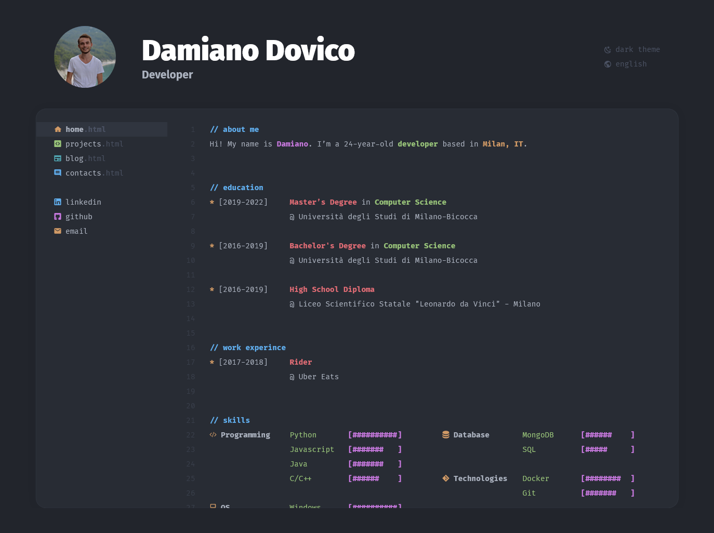

# dovico.dev


## Installation
To run the code just use
```bash
docker-compose up
```

Or

```bash
docker build -t dovico.dev .

docker run \
    -it \
    --rm \
    -v ${PWD}:/app \
    -v /app/node_modules \
    -p 3001:3000 \
    -e CHOKIDAR_USEPOLLING=true \
    --name dovico.dev \
    dovico.dev
```

The website will be available at `localhost:3001`.

## Credits
* Nerd Fonts
* OneDark color scheme